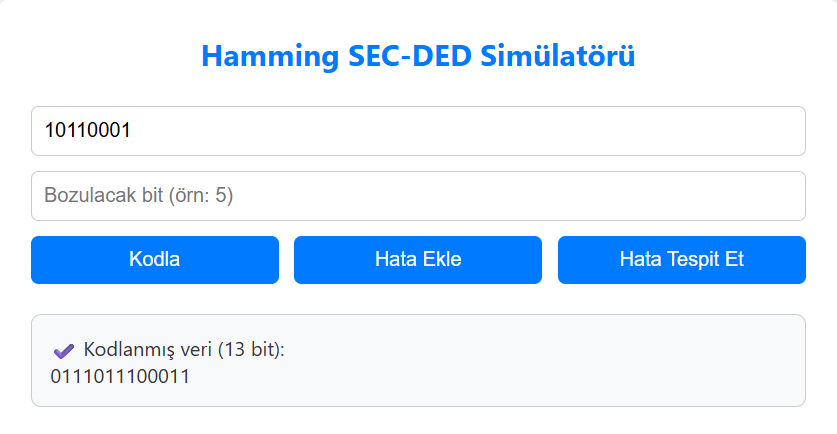
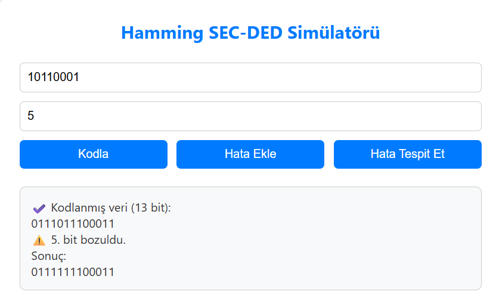
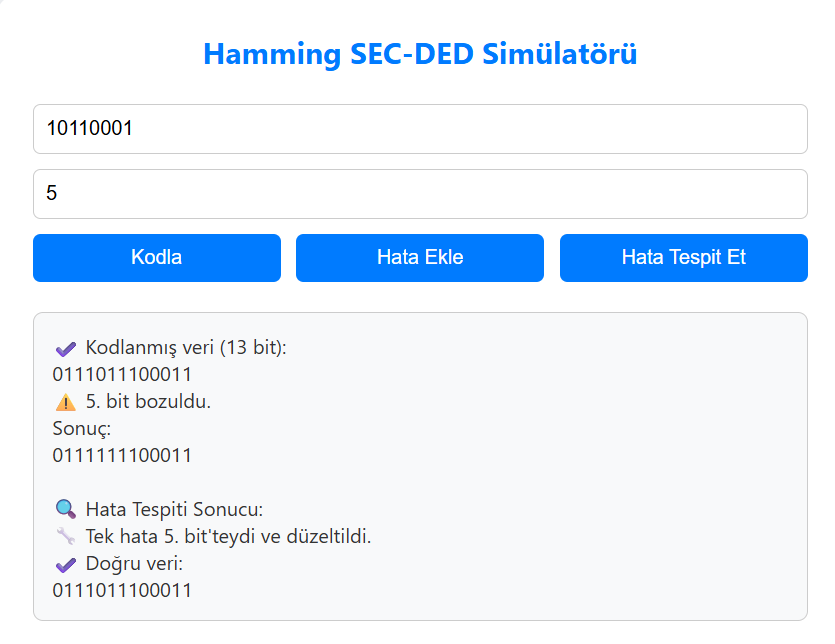
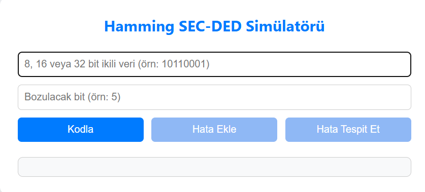
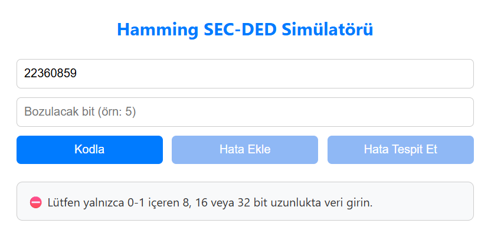

# 🔧 Hamming SEC-DED Simülatörü

Bu proje, **tek hata düzeltme ve çift hata algılama (SEC-DED)** özelliğine sahip bir Hamming kodu simülatörüdür. 8, 16 veya 32 bit uzunluğunda ikili verileri alarak kodlama yapabilir, manuel olarak hata ekleyebilir ve bu hataları tespit edip düzeltebilir.

---

## 🚀 Özellikler

- ✅ 8, 16 ve 32 bitlik giriş verilerini destekler  
- 🔐 Hamming (SEC-DED) algoritmasıyla veri kodlama  
- 🛠️ Manuel hata ekleme (tek bit)
- 🧠 Hata tespiti ve otomatik düzeltme  
- ❌ Çift hata algılama ve uyarı  
- 👨‍💻 Tamamen HTML, CSS ve JavaScript ile yazılmıştır  

---

## 🖼️ Arayüz Görselleri

> `screenshot/` klasöründe bulunan ekran görüntüleri:

### Kodlanmış Veri

### Hata Eklendi

### Düzeltme Sonucu

### Arayüz Genel Görünüm

### Hatalı Veri Girişi Uyarısı

---

## ▶️ Video Tanıtımı

Projeyi çalışırken görmek istersen aşağıdaki bağlantıdan videoya göz atabilirsin:  
📺 [YouTube Video Linki](https://youtu.be/xscblTh3--E)

---

## 📌 Fonksiyonlar

| Fonksiyon | Açıklama |
|----------|----------|
| `calcParityCount(m)` | Verilen veri uzunluğuna (m) göre gerekli parite bitlerinin sayısını hesaplar. |
| `encode()` | Giriş verisini Hamming SEC-DED yöntemine göre kodlar ve genel parite biti ekler. |
| `injectError()` | Kullanıcının belirttiği bit pozisyonunda veride bozulma (hata) oluşturur. |
| `detectAndCorrect()` | Verideki hataları tespit eder. Tek hataları düzeltir, çift hataları bildirir. |
| `setButtons(enabled)` | Hata ekle ve hata tespit et butonlarının aktif/pasif olmasını kontrol eder. |

---

